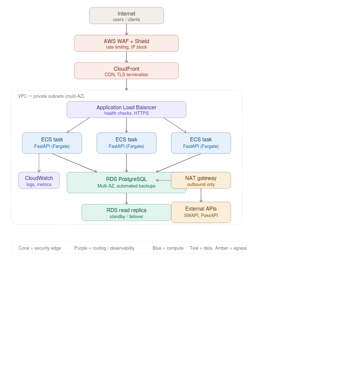

# Super Soccer Showdown 🏆

Star Wars vs Pokémon team generator

## Setup

```bash
# Install Poetry (if needed)
curl -sSL https://install.python-poetry.org | python3 -

# Install dependencies
poetry install

# Install with dev dependencies
poetry install --with dev
```

## Database Migrations

```bash
# Apply all migrations
poetry run alembic upgrade head

# Roll back one step
poetry run alembic downgrade -1

# Auto-generate a new migration after changing ORM models
poetry run alembic revision --autogenerate -m "description"

```

## Run

```bash
# Local dev (SQLite)
poetry run uvicorn main:app --reload
```

## API

Can be found here : http://localhost:8000/docs

## Tests

```bash
poetry run pytest
poetry run pytest --cov=. --cov-report=term-missing #with coverage
```

## Adding a New Universe

1. Create `adapters/marvel.py` implementing `UniverseInterface`
2. Add `MARVEL = "marvel"` to `Universe` in `domain/models.py`
3. Register it in `main.py` ar start up

## AWS deployment Diagram


